# 🌀 bluer-sbc

🌀 `bluer-sbc` is a [`bluer-ai`](https://github.com/kamangir/bluer-ai) plugin for edge computing on [single board computers](https://github.com/kamangir/blue-bracket). 

```bash
pip install bluer_sbc

# @env dot list
@env dot cp <env-name> local
```

--table--

```mermaid
graph LR
    camera["@sbc <camera> capture|preview image|video"]

    hardware_validate["@sbc <hardware> validate <options>"]

    object["📂 object"]:::folder
    camera_hardware["👁️‍🗨️ camera"]:::folder
    hardware["🖱️ hardware"]:::folder
    UI["💻 UI"]:::folder

    camera_hardware --> camera
    camera --> object
    camera --> UI

    hardware --> hardware_validate
    hardware_validate --> hardware
    hardware_validate --> UI

    classDef folder fill:#999,stroke:#333,stroke-width:2px;
```



---

> 🌀 [`blue-sbc`](https://github.com/kamangir/blue-sbc) for the [Global South](https://github.com/kamangir/bluer-south).

---

--signature--

